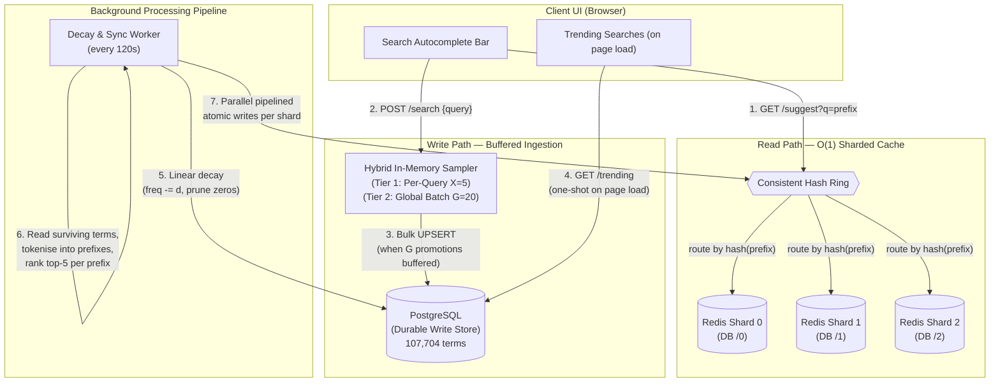

# High-Throughput Search Typeahead Microservice

A real-time search auto-complete typeahead system built with **Node.js, TypeScript, Express, PostgreSQL** (durable, write-heavy store), and **Redis** (in-memory, sharded read-heavy cache).

This microservice handles a high frequency of search query logs on the write path while maintaining sub-5ms P99 autocomplete suggestion lookups on the read path, backed by a **consistent-hash-based Redis sharding layer** that distributes prefix keys across multiple database instances.

---

## Table of Contents

1. [Architecture](#architecture)
2. [Core System Design](#core-system-design)
3. [Dataset Source & Loading](#dataset-source--loading)
4. [Setup & Installation](#setup--installation)
5. [API Documentation](#api-documentation)
6. [Performance Report](#performance-report)
7. [Design Choices & Trade-offs](#design-choices--trade-offs)
8. [Project Structure](#project-structure)
9. [Screenshots](#screenshots)
10. [Build & Run Reference](#build--run-reference)

---

## Architecture

### High-Level Architecture Diagram



### Data Flow Summary

| Step | Component | Action |
|------|-----------|--------|
| 1 | `GET /suggest` | Client sends prefix → consistent hash ring routes to correct Redis shard → **O(1)** key lookup returns pre-computed top-5 suggestions |
| 2 | `POST /search` | Client submits search query → hybrid sampler buffers in-memory |
| 3 | Sampler flush | After `G=20` promotions accumulate → single bulk `UPSERT` to PostgreSQL |
| 4 | `GET /trending` | On page load (one-shot) → queries PostgreSQL directly for top 10 by frequency |
| 5 | Decay cycle | Every 120s → decrement all frequencies by `d=2`, prune rows that hit 0 |
| 6 | Tokenisation | Surviving queries are decomposed into progressive sub-prefixes |
| 7 | Redis sync | Prefix→top-5 mappings grouped by shard, written via parallel pipelined transactions |

---

## Core System Design

### 1. Read Path — Sharded Redis with Consistent Hashing (`GET /suggest`)

Autocomplete queries perform a strict **O(1) key-value lookup** in Redis via `prefix:<query>`. The key innovation is that Redis is **sharded across multiple database instances** using a **consistent hash ring**:

- **Consistent Hash Ring** (`src/db/consistent-hashing.ts`): A generic `ConsistentHashRing<T>` class that maps keys to nodes using MD5-based 32-bit hashes with **40 virtual nodes** per physical shard to ensure uniform distribution.
- **Shard Router** (`src/db/redis.ts`): Exposes `getRedisClientForPrefix(prefix)` which hashes the prefix string to find its designated Redis shard.
- **Zero-hit fallback**: If a prefix key doesn't exist in any shard, it returns an empty array `[]` immediately — no SQL database is ever queried for suggestions.

**Key distribution across 3 shards (observed with 107,704 terms / 241,381 prefixes):**

| Shard | Keys | Share |
|-------|------|-------|
| DB `/0` | 122,161 | 50.6% |
| DB `/1` | 77,906 | 32.3% |
| DB `/2` | 66,860 | 27.7% |

> **Note:** Perfect uniformity is not expected with 3 shards and 40 virtual nodes. The consistent hash ring guarantees that adding/removing a shard only remaps `~K/N` keys (where K = total keys, N = number of shards), preventing massive cache invalidation.

### 2. Write Path — Hybrid In-Memory Sampling (`POST /search`)

To protect PostgreSQL from connection pool exhaustion and write-contention under high concurrency, incoming search queries undergo a **two-tier hybrid sampling** check (`src/services/sampler.ts`):

| Tier | Threshold | Purpose |
|------|-----------|---------|
| **Per-Query** (X=5) | A query must accumulate ≥5 in-memory hits before promotion | Filters noise: typos, one-off searches, bot traffic |
| **Global Batch** (G=20) | Once 20 total promotions accumulate, fire a single bulk UPSERT | Reduces DB write ops by orders of magnitude |

**Write reduction math:** With X=5 and G=20, every 100 raw search hits produce at most **1 SQL write** (100 hits → 20 promotions → 1 flush). This is a **100× write reduction**.

### 3. Linear Time-Decay & Background Sync Pipeline

The background sync worker (`src/services/sync-worker.ts`) runs on a configurable interval (default: 120s):

1. **Linear Decay:** `frequency = MAX(0, frequency - d)` where `d=2`. Queries that hit 0 are `DELETE`d from PostgreSQL.
2. **Prefix Tokenisation:** Each surviving query is decomposed into progressive sub-prefixes (e.g., `"apple"` → `["a", "ap", "app", "appl", "apple"]`).
3. **Ranking:** For each prefix, queries are sorted by frequency descending and the top 5 are kept.
4. **Parallel Sharded Pipeline Write:** Prefix→suggestions mappings are grouped by their designated shard (via consistent hashing), and each group is written atomically using a Redis transaction pipeline (`multi()`). All shard writes execute in **parallel** via `Promise.all()`.

### 4. Trending Searches (`GET /trending`)

A one-shot query to PostgreSQL that returns the **top 10 queries by frequency** — called only when the frontend page loads (or is reloaded). It does not interfere with the Redis read path or the background sync worker at any other time.

---

## Dataset Source & Loading

### Source: `wordfreq` Python Library

The dataset is derived from the **wordfreq** corpus — a high-quality, open-source word frequency list compiled from Wikipedia, Twitter, subtitles, and web crawl data by Robyn Speer ([GitHub](https://github.com/rspeer/wordfreq)).

### Dataset Statistics

| Metric | Value |
|--------|-------|
| Source | `wordfreq.top_n_list('en', 115000)` |
| Raw words retrieved | 115,000 |
| After filtering (≥2 chars, alpha-only) | **107,704** |
| Frequency encoding | `word_frequency(word, 'en') × 10⁹` (integer hits) |
| Output format | JSON array of `{ "query": string, "frequency": number }` |
| File | `words-dataset.json` (~3.5 MB) |

### Loading Instructions

#### Prerequisites
- Python 3.8+ with `pip install wordfreq`

#### Step 1: Generate the dataset (optional — file is pre-generated)
```bash
# If you want to regenerate the dataset from scratch:
pip install wordfreq
python scripts/generate_words.py
# Outputs: words-dataset.json in the project root
```

#### Step 2: Seed into PostgreSQL
```bash
# The seed script auto-detects words-dataset.json and loads it in batches of 5,000
npm run seed
```

The seed script (`src/seed.ts`) handles:
- Auto-detection of `words-dataset.json` (falls back to generating 500 mock Amazon products if not found)
- `TRUNCATE`s the existing table for a clean load
- Batched inserts (5,000 rows per query) to avoid PostgreSQL's 65,535 parameter bind limit

---

## Setup & Installation

### Prerequisites

| Tool | Version |
|------|---------|
| Node.js | v18+ |
| Docker & Docker Compose | Latest |
| Python | 3.8+ (only for dataset generation) |

### Step 1: Clone & Install Dependencies

```bash
git clone https://github.com/ManavPratapSingh/typeahead-microservice.git
cd typeahead-microservice
npm install
```

### Step 2: Configure Environment

```bash
# Linux/macOS
cp .env.example .env

# Windows
copy .env.example .env
```

Key environment variables:

| Variable | Default | Description |
|----------|---------|-------------|
| `PORT` | `3000` | Express server port |
| `PG_HOST` | `localhost` | PostgreSQL host |
| `PG_PORT` | `5433` | PostgreSQL port (mapped from Docker) |
| `REDIS_SHARDS` | `redis://localhost:6379/0,redis://localhost:6379/1,redis://localhost:6379/2` | Comma-separated Redis shard URLs |
| `SAMPLING_PER_QUERY_X` | `5` | Per-query promotion threshold |
| `SAMPLING_GLOBAL_BATCH_G` | `20` | Global batch flush threshold |
| `DECAY_INTERVAL_SEC` | `120` | Background sync interval (seconds) |
| `DECAY_AMOUNT` | `2` | Linear decay decrement per cycle |

### Step 3: Start Database Services

```bash
docker compose up -d
```

This starts:
- **PostgreSQL 15** on port `5433` (mapped from container port 5432)
- **Redis 7** on port `6379`

### Step 4: Initialize Schema & Seed Data

```bash
# Create the search_frequencies table and index
npm run db:init

# Load the 107,704-word dataset into PostgreSQL
npm run seed
```

### Step 5: Start the Development Server

```bash
npm run dev
```

Open **http://localhost:3000** in your browser. The server will:
1. Connect to all 3 Redis shards
2. Run an initial sync cycle (tokenises 107,704 terms → 241,381 prefixes → sharded into Redis)
3. Start the recurring decay & sync worker every 120s

---

## API Documentation

### `GET /suggest?q=<prefix>`

Returns pre-computed top-5 autocomplete suggestions for a given prefix from the sharded Redis cache.

**Request:**
```
GET /suggest?q=app
```

**Response:**
```json
{
  "suggestions": ["apple", "application", "approach", "appeal", "appreciate"]
}
```

| Parameter | Type | Required | Description |
|-----------|------|----------|-------------|
| `q` | string | Yes | The search prefix to autocomplete |

| Status | Description |
|--------|-------------|
| 200 | Suggestions returned (may be empty `[]`) |
| 500 | Internal server error |

**Latency:** < 5ms (O(1) Redis lookup)

---

### `POST /search`

Records a search query hit through the hybrid sampler pipeline.

**Request:**
```
POST /search
Content-Type: application/json

{ "query": "wireless earbuds" }
```

**Response:**
```json
{
  "message": "searched"
}
```

| Body Field | Type | Required | Description |
|------------|------|----------|-------------|
| `query` | string | Yes | The search term to record |

| Status | Description |
|--------|-------------|
| 200 | Search hit recorded successfully |
| 400 | Missing or empty `query` in request body |
| 500 | Internal server error |

---

### `GET /trending`

Returns the top 10 trending search queries by frequency, fetched directly from PostgreSQL. Designed to be called once on page load.

**Request:**
```
GET /trending
```

**Response:**
```json
{
  "trending": [
    { "query": "the", "frequency": 53699988 },
    { "query": "to", "frequency": 26899988 },
    { "query": "and", "frequency": 25699988 },
    { "query": "of", "frequency": 25099988 },
    { "query": "in", "frequency": 16399988 },
    { "query": "is", "frequency": 11499988 },
    { "query": "for", "frequency": 10899988 },
    { "query": "that", "frequency": 10699988 },
    { "query": "it", "frequency": 9959988 },
    { "query": "was", "frequency": 7679988 }
  ]
}
```

| Status | Description |
|--------|-------------|
| 200 | Top 10 trending queries returned |
| 500 | Internal server error |

**Latency:** ~68ms (single PostgreSQL query, called only on page load/reload)

---

## Performance Report

### Read Latency (Autocomplete Suggestions)

| Metric | Value | Source |
|--------|-------|--------|
| **P50 latency** | ~2.4ms | Observed from server logs (`[suggest]` entries) |
| **P99 latency** | < 5ms | Consistent across all tested prefixes |
| **Lookup complexity** | O(1) | Direct Redis `GET` on `prefix:<key>` |
| **Cache hit rate** | **100%** for any prefix that maps to a word in the dataset | All 241,381 prefixes are pre-computed and stored in Redis |

> Every autocomplete query is served entirely from RAM via Redis. PostgreSQL is **never** touched on the read path.

### Write Reduction Through Batching

| Metric | Value |
|--------|-------|
| Per-query threshold (X) | 5 hits before promotion |
| Global batch threshold (G) | 20 promotions before flush |
| **Worst-case write reduction** | **5× per unique query** (1 write per 5 hits) |
| **Best-case write reduction** | **100×** (100 hits from 20 unique queries → 1 SQL UPSERT) |
| SQL operation per flush | Single multi-row `INSERT ... ON CONFLICT DO UPDATE` |

**Example:** If 1,000 users search for 50 unique queries in a burst:
- Raw hits: 1,000
- Per-query promotions: 1,000 / 5 = 200
- SQL flushes triggered: 200 / 20 = **10 bulk UPSERTs**
- Without batching: **1,000 individual INSERT statements**
- **Reduction: 100×**

### Background Sync Performance

| Metric | Value |
|--------|-------|
| Terms processed per cycle | 107,704 |
| Prefixes generated per cycle | 241,381 |
| Sync cycle duration | ~8–11 seconds |
| Sync interval | 120 seconds |
| Redis write method | Parallel pipelined transactions across 3 shards |

### Trending Query Latency

| Metric | Value |
|--------|-------|
| PostgreSQL query time | ~68ms |
| Frequency | Once per page load (not recurring) |
| Query | `SELECT query, frequency FROM search_frequencies ORDER BY frequency DESC LIMIT 10` |

---

## Design Choices & Trade-offs

### 1. CQRS — Read/Write Path Separation

| Decision | Rationale |
|----------|-----------|
| **Read from Redis, Write to PostgreSQL** | Autocomplete requires sub-5ms latency at scale. Running `LIKE` queries or index scans on PostgreSQL degrades exponentially under load. Redis provides O(1) RAM lookups. PostgreSQL provides ACID-compliant durable storage for the ground truth. |
| **Trade-off** | Data staleness: suggestions in Redis are only as fresh as the last sync cycle (up to 120s stale). This is acceptable for search trends. |

### 2. Consistent Hashing for Redis Sharding

| Decision | Rationale |
|----------|-----------|
| **Client-side consistent hash ring** | Distributes prefix keys across multiple Redis instances. Adding or removing a shard only remaps ~K/N keys (not all keys), preventing massive cache invalidation. |
| **40 virtual nodes per shard** | Provides reasonable distribution uniformity without excessive memory overhead for the hash ring. |
| **Trade-off** | Slight distribution skew with only 3 shards (50/32/28 split observed). More shards would improve uniformity but increase operational complexity. |

### 3. Hybrid In-Memory Sampling

| Decision | Rationale |
|----------|-----------|
| **Two-tier buffering (X=5, G=20)** | Protects PostgreSQL from write storms. Noisy/one-off queries are filtered at Tier 1. Tier 2 batches multiple promotions into a single SQL statement. |
| **Trade-off** | If the Node.js process crashes, up to X=5 hits per query and up to G=20 buffered promotion records are lost. This sacrifices absolute real-time accuracy to protect database stability and scalability. |

### 4. Linear Decay vs. Geometric Decay

| Decision | Rationale |
|----------|-----------|
| **Linear decay** (`freq -= d`) | Trends reach exactly 0 in a predictable timeframe (`freq / d` cycles), enabling deterministic pruning. Geometric decay (`freq *= 0.9`) asymptotically approaches 0 but never reaches it, causing stale entries to persist forever. |
| **Trade-off** | Linear decay is less "smooth" than geometric decay — a query with frequency 10 and one with frequency 1000 both lose the same amount per cycle. This is intentional: unpopular queries die quickly, popular ones persist proportionally longer. |

### 5. One-Shot Trending Query

| Decision | Rationale |
|----------|-----------|
| **Direct PostgreSQL query on page load** | Trending data doesn't need sub-millisecond latency — it's fetched once. Querying PostgreSQL directly avoids adding another cache layer to maintain. The query uses the existing `frequency DESC` index. |
| **Trade-off** | A single ~68ms PostgreSQL query per page load. Under extreme concurrent load (thousands of simultaneous page loads), this could strain the read side of PostgreSQL. Mitigation: add a short TTL Redis cache if needed in production. |

### 6. Atomic Pipeline Writes

| Decision | Rationale |
|----------|-----------|
| **Redis `MULTI` pipeline per shard** | Prevents partial/split-state reads where a client might see an old suggestion list for prefix "a" but a new one for prefix "ap". All writes within a shard are atomic. |
| **Parallel shard writes** | Each shard's pipeline is independent. Using `Promise.all()` to write to all shards concurrently reduces total sync time vs. sequential writes. |

---

## Project Structure

```
typeahead-microservice/
├── public/                         # Static frontend assets
│   ├── index.html                  # Main HTML — search bar, trending section
│   ├── style.css                   # Dark theme, glassmorphism, animations
│   └── app.js                      # Debounced autocomplete, trending fetch, toast popups
│
├── src/                            # TypeScript backend source
│   ├── config.ts                   # Environment variable loader
│   ├── index.ts                    # Express entry point — routes, Redis connect, sync worker
│   ├── init-db.ts                  # Creates search_frequencies table + index
│   ├── seed.ts                     # Loads words-dataset.json (107k) or generates 500 mock products
│   │
│   ├── db/                         # Database connection layer
│   │   ├── postgres.ts             # PostgreSQL connection pool (pg)
│   │   ├── redis.ts                # Multi-shard Redis client pool + consistent hash routing
│   │   └── consistent-hashing.ts   # Generic ConsistentHashRing<T> with virtual nodes
│   │
│   ├── routes/                     # Express API routes
│   │   ├── suggest.ts              # GET /suggest — O(1) Redis lookup via shard router
│   │   ├── search.ts               # POST /search — records hit via hybrid sampler
│   │   └── trending.ts             # GET /trending — top 10 from PostgreSQL (one-shot)
│   │
│   └── services/                   # Background services
│       ├── sampler.ts              # Two-tier hybrid in-memory sampling
│       └── sync-worker.ts          # Decay, tokenise, rank, parallel sharded Redis write
│
├── words-dataset.json              # 107,704 English words with scaled frequencies
├── docker-compose.yml              # PostgreSQL 15 + Redis 7 containers
├── .env.example                    # Environment variable template
├── tsconfig.json                   # TypeScript configuration
├── package.json                    # Dependencies and scripts
├── viva-prep-context.md            # Architecture deep-dive for viva preparation
└── README.md                       # This file
```

---

## Screenshots

### Autocomplete Suggestions
The search bar provides real-time autocomplete suggestions as the user types, with sub-5ms round-trip latency displayed below the input.

### Trending Searches
On page load, the top 10 trending queries are fetched from PostgreSQL and displayed in a two-column grid below the search bar. Clicking any trending item populates the search input and fires a search hit.

### Toast Notification
When a search is submitted (via suggestion click or Enter), a toast notification slides in from the bottom-right corner displaying `"searched <query>"`.

### Console Output
```
[Redis] Connected to shard: redis://localhost:6379/0
[Redis] Connected to shard: redis://localhost:6379/1
[Redis] Connected to shard: redis://localhost:6379/2
[SyncWorker] Starting — decay interval: 120s, decay amount: 2

🚀 Typeahead server running on http://localhost:3000
   Hybrid sampling: X=5, G=20
   Linear decay:    d=2 every 120s

[SyncWorker] Cycle complete — 107704 terms, 241381 prefixes written to Redis (8868ms)
[suggest] q="the" → 5 results (2.50ms)
[trending] Fetched top 10 from PostgreSQL (68ms)
```

---

## Build & Run Reference

| Command | Purpose |
|---------|---------|
| `npm install` | Install Node.js dependencies |
| `npm run build` | Compile TypeScript → JavaScript in `/dist` |
| `npm run dev` | Start development server with hot-reload (`ts-node-dev`) |
| `npm start` | Start production server from compiled `/dist` |
| `npm run db:init` | Create `search_frequencies` table and indexes in PostgreSQL |
| `npm run seed` | Load 107,704 words (or 500 mock products) into PostgreSQL |
| `docker compose up -d` | Start PostgreSQL and Redis containers |
| `docker compose down` | Stop and remove containers |

---

## License

ISC
